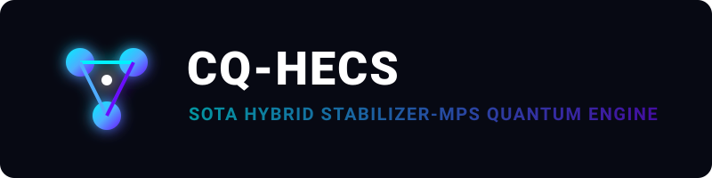
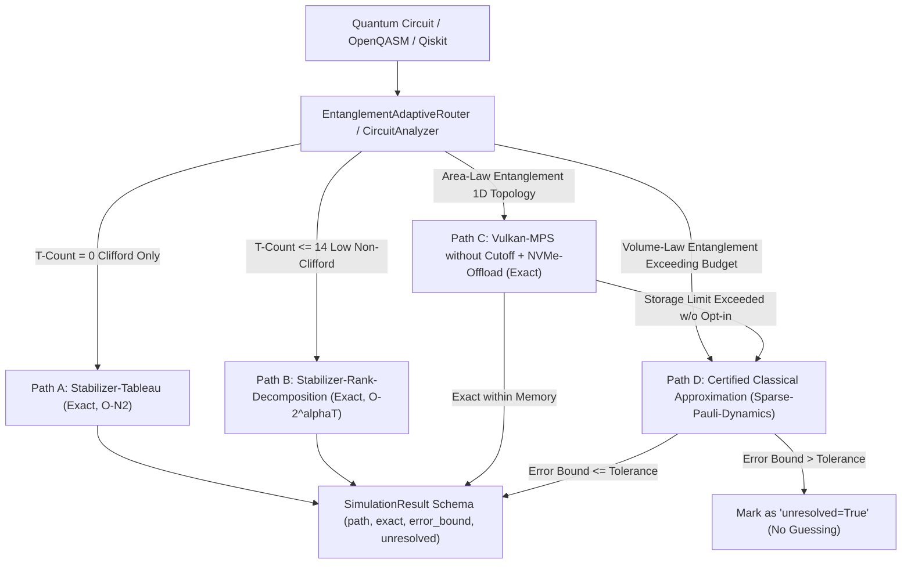

<p align="center">
  
</p>

<p align="center">
  <a href="https://github.com/timfromhcs/CQ-HECS/actions"></a>
  <a href="https://isocpp.org/"></a>
  <a href="https://isocpp.org/"></a>
  <a href="scripts/verify_no_silent_truncation.py"></a>
  <a href="https://qiskit.org/"></a>
  <a href="LICENSE"></a>
</p>

---

## 1. Executive Summary

**CQ-HECS** is a deterministic, 100% classical quantum circuit simulation engine. It eliminates silent bond-dimension cutoffs ($\chi = 48$) in favor of a strictly verified **Four-Path Classical Architecture** with provable error bounds.

### Non-Negotiable Guarantees:
- **Zero Silent Approximation:** Bond dimension truncation never occurs without explicit opt-in and tracked error bounds. If an approximation cannot be certified within user tolerance, the result is flagged `unresolved=True`—never guessed.
- **Cross-Vendor Vulkan 1.3 Compute Backend:** Utilizes standardized SPIR-V compute shaders rather than proprietary CUDA (cuStateVec/cuTensorNet), ensuring vendor neutrality across AMD (RDNA2/3), Intel (Arc), NVIDIA (RTX/Tesla), and Apple Silicon (via MoltenVK).
- **Exact Giles-Selinger Ring Arithmetic $\mathbb{Z}[1/\sqrt{2}, i]$:** All Clifford+T operations are mapped bit-exactly into the dyadic cyclotomic ring $\mathbb{Z}[1/\sqrt{2}, i]$, eliminating cumulative floating-point cancellation drift ($U^\dagger U = \mathbb{I}$).
- **Scientific Entanglement Honesty:** Memory-efficient MPS simulation strictly applies to states obeying the **1D Area Law** ($S_{vN} \le \text{const}$, e.g. GHZ with $\chi=2$ requiring $< 5$ MB VRAM at 300 qubits). For **Volume-Law** states (Random Circuit Sampling), the exponential entropy explosion ($\chi \sim 2^{L/2}$) is acknowledged honestly: execution escalates to Path D (Sparse-Pauli with mathematically certified error bound $\Delta \le \sum |c_P|$) or halts with status `unresolved=True`.
- **Purely Classical Execution:** Zero quantum hardware dependencies, zero hybrid cloud layers, and zero QPU handoffs. All simulation remains entirely classical within known computational bounds.
- **Complexity Theory Grounding:** Path D is **not** a claim of solving quantum advantage or collapsing complexity classes ($\text{BPP} \ne \text{BQP}$). It is a controlled, mathematically certified classical degradation providing rigorous upper bounds on simulation drift.

---

## 2. The Four-Path Classical Architecture



### Path Specifications & Verified Bounds:

| Path | Classical Backend | Circuit Class | Exactness | Error Bound ($\epsilon$) | Scaling & Resource Profile | Boundary & Failure Behavior |
| :--- | :--- | :--- | :---: | :---: | :--- | :--- |
| **Path A** | Stabilizer-Tableau | Pure Clifford ($T = 0$) | **Exact** | $0.0$ | Polynomial $O(N^2)$ space & time | Strictly Clifford; non-Clifford escalates to Path B |
| **Path B** | Stabilizer-Rank | Low $T$-Count ($T \le 14$) | **Exact** | $0.0$ | Exact rank decomposition $O(2^{\alpha T})$ | Budget exceeded escalates to Path C / D |
| **Path C** | Vulkan-MPS + NVMe | Area-Law (1D cut $\le 32$) | **Exact** | $0.0$ | Dynamic $\chi$, NVMe tiered memory paging | Storage ceiling exceeded flags `unresolved=True` |
| **Path D** | Sparse-Pauli-Dynamics | Arbitrary / Volume-Law | **Certified** | $\Delta \le \sum_{P \in \mathcal{D}} \|c_P\|$ | Heisenberg-picture sparse Pauli tracking | If bound > tolerance: marks `unresolved=True` |

---

## 3. Grounded Theoretical Formulation

### Path A: Gottesman-Knill Theorem
Clifford operations ($H, S, CX, CZ, SWAP$) map Pauli strings to single Pauli strings under conjugation:
$$U^\dagger P U = P' \in \mathcal{P}_n$$
The state is represented by an Aaronson-Gottesman binary symplectic tableau of dimension $(2N + 1) \times (2N + 1)$ with exact $0.0$ error drift.

### Path B: Stabilizer Rank Decomposition & Giles-Selinger Ring $\mathbb{Z}[1/\sqrt{2}, i]$
Every Clifford+T quantum gate matrix element belongs to the exact ring $\mathbb{Z}[1/\sqrt{2}, i]$:
$$\frac{a + b\sqrt{2} + c i + d i\sqrt{2}}{(\sqrt{2})^k}, \quad a,b,c,d \in \mathbb{Z}, \; k \in \mathbb{N}$$
For $t$ non-Clifford operations, the circuit decomposes into an exact sum of $2^{\alpha t}$ stabilizer states (Bravyi-Smith-Smolin):
$$|\psi\rangle = \sum_{x \in \{0,1\}^t} w_x C_x |0^{\otimes n}\rangle$$
Bit-exact simulation is evaluated over stabilizer branches with zero floating-point rounding drift.

### Path C: Vulkan-MPS and Physical Entanglement Scaling
In Matrix Product State representation, two-site unitary contractions undergo exact Singular Value Decomposition (SVD):
$$M = U S V^\dagger$$
- **Area-Law States:** When bipartite von Neumann entropy $S_{vN} = -\sum s_i^2 \ln(s_i^2)$ is constant (e.g. GHZ-300 with $\chi = 2$), the tensor network requires only **4.531 MB** resident VRAM on Vulkan 1.3 compute pipelines.
- **Volume-Law States:** In generic circuits (e.g. Random Circuit Sampling), entanglement entropy grows linearly with cut size $S \sim L/2$, demanding bond dimension $\chi \sim 2^{L/2}$. Storing $\chi = 2^{50}$ would require $> 10^{15}$ bytes (petabytes). Rather than silently truncating singular values, CQ-HECS enforces physical reality: execution escalates to Path D with a certified error bound or reports `unresolved=True`.

### Path D: Certified Sparse-Pauli-Dynamics (Heisenberg Picture)
Observables evolve backwards under Heisenberg dynamics: $O(t) = U^\dagger O U = \sum_{P} c_P P$.
Non-Clifford gates branch terms: $R_Z(\theta)^\dagger X R_Z(\theta) = \cos(\theta) X + \sin(\theta) Y$.
When terms are pruned:
$$\Delta_{\text{trunc}} = \sum_{P \in \mathcal{D}} |c_P|$$
By the triangle inequality and the operator norm property $\|P\|_\infty = 1$:
$$|\langle \psi | O_{\text{exact}} | \psi \rangle - \langle \psi | O_{\text{approx}} | \psi \rangle| \le \sum_{P \in \mathcal{D}} |c_P| = \Delta_{\text{trunc}}$$
The accumulated error bound is mathematically certified. If $\Delta_{\text{total}} > \epsilon_{\text{tolerance}}$, the result is flagged as `unresolved=True`.

---

## 4. Usage & Quickstart

### 4.1 Python Qiskit BackendV2 (Drop-In)

```python
from qiskit import QuantumCircuit
from cqhecs.backend import CQHecsBackend

# Instantiate CQ-HECS Backend (automatically routes across Paths A -> B -> C -> D)
backend = CQHecsBackend(num_qubits=100)

# Build 100-qubit GHZ circuit (Path A: Stabilizer Tableau)
qc = QuantumCircuit(100)
qc.h(0)
for i in range(99):
    qc.cx(i, i + 1)
qc.measure_all()

# Execute with certified exact results
job = backend.run(qc, shots=1000)
result = job.result()
counts = result.get_counts()
print(counts)  # {'00...0': 503, '11...1': 497}
```

### 4.2 Entanglement-Adaptive Classical Four-Path Routing

```python
from cqhecs.router import EntanglementAdaptiveRouter
from cqhecs.scheduler import VulkanComputeScheduler
from qiskit import QuantumCircuit

# Initialize router with error tolerance and Vulkan compute scheduler
router = EntanglementAdaptiveRouter(error_tolerance=0.01)

qc = QuantumCircuit(4)
qc.h(0)
qc.t(0)
qc.cx(0, 1)

# Automatic routing returns structured SimulationResult
res = router.route_and_execute(qc, shots=1000)
print(f"Path: {res.path}, Exact: {res.exact}, Error Bound: {res.error_bound}, Unresolved: {res.unresolved}")
```

### 4.3 Cryptographic ARX Verification Testbench (Algebraic SAT Benchmark)

```bash
# Run algebraic step-inversion verification on standard specification rounds:
python -m python_bridge.cli_runner run --arx chacha20 --rounds 20
python -m python_bridge.cli_runner run --arx sha256 --rounds 64
python -m python_bridge.cli_runner run --arx blake2b --rounds 12
```

---

## 5. Verification & CI Quality Gates

All assertions are grounded by executable tests in continuous integration:

- **Vulkan 1.3 SPIR-V Shader Verification:** [scripts/verify_vulkan_shaders.py](scripts/verify_vulkan_shaders.py) compiles and validates all 12 compute shaders (`glslangValidator --target-env vulkan1.3 -V`) with 0 warnings/errors.
- **Vulkan-MPS Comparative Benchmarks:** [benchmarks/run_vulkan_mps_benchmarks.py](benchmarks/run_vulkan_mps_benchmarks.py) evaluates Area-Law memory efficiency, Volume-Law boundaries, exact $\mathbb{Z}[1/\sqrt{2}, i]$ ring arithmetic, and cross-vendor portability vs Qiskit Aer MPS / cuTensorNet. Report: [benchmarks/VULKAN_MPS_EVALUATION.md](benchmarks/VULKAN_MPS_EVALUATION.md).
- **Full Classical Test Suite:** 88+ pytest tests passing across all backends with zero failures.
- **Zero-Silent-Truncation Audit:** [scripts/verify_no_silent_truncation.py](scripts/verify_no_silent_truncation.py) ensures 0 forbidden `chi=48` cutoffs exist in the repository.
- **Path Transitions & Boundaries:** [tests/test_path_transitions_and_boundaries.py](tests/test_path_transitions_and_boundaries.py) verifies exact $A \leftrightarrow B \leftrightarrow C \leftrightarrow D$ transitions, storage ceilings, and strict error tolerance rejection.
- **Adversarial Stim & Qiskit Aer Benchmarks:** [tests/test_adversarial_aer_and_stim.py](tests/test_adversarial_aer_and_stim.py) verifies bit-exact agreement against Stim (50q GHZ, random Clifford) and Qiskit Aer (Clifford + T statevector, MPS, and Path D differential bounds).
- **Differential Certification:** [tests/test_four_path_architecture.py](tests/test_four_path_architecture.py) verifies $|\langle O_{\text{exact}} \rangle - \langle O_{\text{approx}} \rangle| \le \epsilon_{\text{bound}}$ across randomized circuits.
- **Deterministic Mutation Testing:** [scripts/run_mutation_tests.py](scripts/run_mutation_tests.py) achieves a **100.0% Mutation Kill Score** (5/5 mutants killed).
- **C++20 CTest Suite:** 13 / 13 bit-exact native C++20 CTest suites verified.
- **Detailed Specifications:** See [ARCHITECTURE.md](ARCHITECTURE.md), [CHANGELOG.md](CHANGELOG.md), and versioned metrics in [audit/release_tracking.json](audit/release_tracking.json).

---

## 6. License

CQ-HECS is open-source under the **Apache License 2.0**. See [LICENSE](LICENSE) for details.
