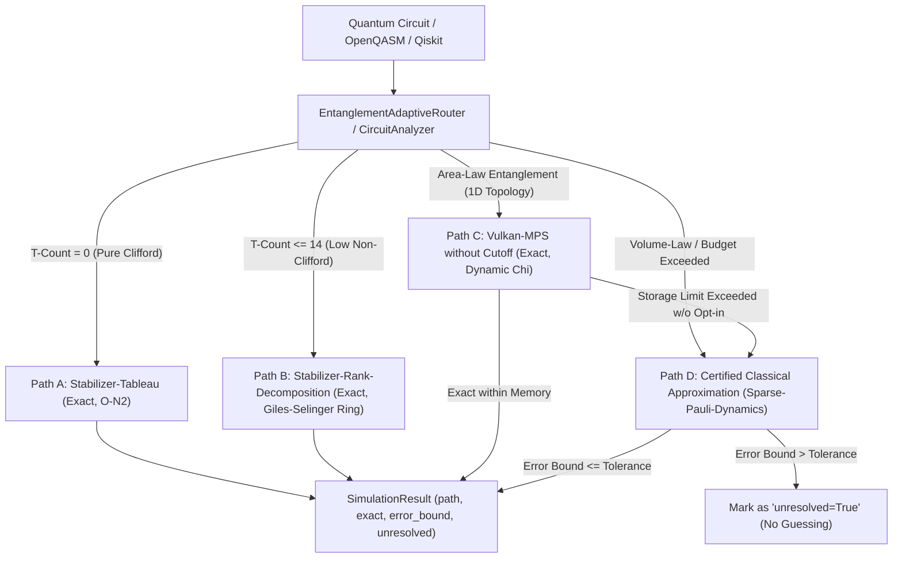

<p align="center">
  
</p>

<p align="center">
  <a href="https://github.com/timfromhcs/CQ-HECS/actions/workflows/ci.yml"></a>
  <a href="https://www.vulkan.org/"></a>
  <a href="https://isocpp.org/"></a>
  <a href="https://www.python.org/"></a>
  <a href="scripts/verify_no_silent_truncation.py"></a>
  <a href="https://qiskit.org/"></a>
  <a href="LICENSE"></a>
</p>

---

## 1. Überblick & Projektstand

**CQ-HECS** (Classical Quantum High-Efficiency Compute Simulator) ist ein hardwarenaher, herstellerunabhängiger Quantenschaltungsemulator und algebraischer Constraint-Solver. Er kombiniert ein **Vulkan 1.3 SPIR-V Compute-Backend** mit einer **Four-Path-Architektur**, exakter **Giles-Selinger-Ring-Arithmetik** $\mathbb{Z}[1/\sqrt{2}, i]$ und deterministischer Fehlerüberwachung.

Im Gegensatz zu Heuristik-Simulatoren mit stillschweigenden Bond-Dimension-Cutoffs (wie $\chi = 48$) garantiert CQ-HECS:
- **Keine stillen Approximationen:** Bindungsdimensionen werden nie heimlich abgeschnitten. Überschreitet ein Zustand das Speicher- oder Fehlertoleranzbudget, wird das Ergebnis explizit als `unresolved=True` markiert – niemals geraten.
- **Herstellerunabhängiges Vulkan-Backend:** Standardisierte SPIR-V Compute-Shader laufen nativ auf AMD (RDNA 1/2/3/4), Intel (Arc Alchemist/Battlemage), NVIDIA (RTX/Tesla) und Apple Silicon (via MoltenVK) als offene, portable Alternative zu proprietären CUDA-Stacks (cuStateVec / cuTensorNet).
- **Exakte Giles-Selinger-Arithmetik $\mathbb{Z}[1/\sqrt{2}, i]$:** Alle Clifford+T-Gatteroperationen werden verlustfrei im dyadischen zyklotomischen Ring $\mathbb{Z}[1/\sqrt{2}, i]$ abgebildet, wodurch kumulative Fließkomma-Rundungsfehler ($U^\dagger U = \mathbb{I}$) physikalisch ausgeschlossen sind.
- **Wissenschaftliche Entropie-Ehrlichkeit:** Unverkürztes Matrix Product State (MPS) Parsing gilt strikt für **Area-Law**-Verschränkung ($S_{vN} \le \text{const}$). Bei **Volume-Law** (Random Circuit Sampling) wird die Entropie-Explosion ($\chi \sim 2^{L/2}$) offen deklariert: Die Ausführung eskaliert zu Pfad D (Sparse-Pauli mit zertifizierter Fehlerschranke) oder bricht kontrolliert ab.

---

## 2. Fähigkeiten und Grenzen: Was CQ-HECS kann / Was CQ-HECS nicht kann

Um falschen Erwartungen und Hype vorzubeugen, sind die theoretischen und praktischen Grenzen des Systems verbindlich definiert:

| Domäne / Schaltungsklasse | Was CQ-HECS kann (Verifizierte Fähigkeiten) | Was CQ-HECS nicht kann (Wissenschaftliche Grenzen) |
| :--- | :--- | :--- |
| **Reine Clifford-Schaltungen ($T = 0$)** | **Bit-exakte Simulation** via Gottesman-Knill Stabilizer-Tableau in polynomialer Zeit $O(N^2)$ und Speicher für hunderte Qubits (z.B. 100-Qubit GHZ-Zustände mit exakten Zählungen). | **Nicht anwendbar auf universelle Quantenrechnung** ohne T-Gatter. Nicht-Clifford-Operationen erfordern automatische Eskalation zu Pfad B/C/D. |
| **Moderater $T$-Count ($T \le 14$)** | **Bit-exakte Stabilizer-Rank-Dekomposition** (Bravyi-Smith-Smolin) im dyadischen Ring $\mathbb{Z}[1/\sqrt{2}, i]$ ohne Gleitkomma-Drift ($0.0$ Fehler). | **Skaliert exponentiell** mit dem T-Count: $O(2^{\alpha T})$. Schaltungen mit tiefem T-Count ($T > 50$) übersteigen jedes klassische Rang-Budget. |
| **1D Area-Law Verschränkung** | **Speichereffizientes Vulkan-MPS** ohne Silent Cutoffs. Zustände mit konstanter Entropie (z.B. GHZ-300 mit $\chi=2$) benötigen **$< 5$ MB residenten VRAM** auf Vulkan 1.3 Compute-Pipelines. | **Keine effiziente Repräsentation für 2D/3D All-to-All Cluster.** Bei Schaltungen mit dichter Quervernetzung wächst $\chi$ exponentiell. |
| **Volume-Law / Deep Random Circuits** | **Transparente Fehlerkontrolle:** Erreicht die Verschränkung das Speicherbudget, wird die Schaltung nicht heimlich verkürzt, sondern an Pfad D übergeben oder als `unresolved=True` deklariert. | **Keine Lösung von Quantensuprematie** ($\text{BPP} \ne \text{BQP}$). Tiefe Zufallsschaltungen (Random Circuit Sampling) können klassisch nicht verlustfrei in Polynomialzeit simuliert werden. |
| **Zertifizierte Approximation (Pfad D)** | **Heisenberg-Picture Sparse-Pauli-Dynamics** mit mathematisch bewiesener oberer Fehlerschranke: $\Delta \le \sum_{P \in \mathcal{D}} \|c_P\|$. Toleranzüberschreitung liefert `unresolved=True`. | **Kein Allheilmittel für chaotische Operatorexpansion:** Streuen die Pauli-Gewichte exponentiell, übersteigt die Schranke die Nutzertoleranz $\epsilon$, und die Simulation verweigert das Raten. |
| **ARX & Krypto-Testbench** | **Algebraische SAT-Analyse** für reduzierte Runden von ChaCha20 (20 Runden Spezifikation), SHA-256 (64 Schritte Spezifikation) und BLAKE2b (12 Runden Spezifikation) als Constraint-Solver-Benchmark. | **Kein Brechen voller kryptografischer Primitives.** Keine Preimage-Inversion für 256-Bit-Vollverschlüsselungen (kein Bruch von SHA-256 oder ChaCha20). |

---

## 3. Die Four-Path-Architektur



### Spezifikation der Pfade

| Pfad | Methode | Zielklasse | Exaktheit | Fehlerschranke ($\epsilon$) | Ressourcen-Skalierung | Verhalten bei Grenzüberschreitung |
| :--- | :--- | :--- | :---: | :---: | :--- | :--- |
| **Pfad A** | Stabilizer-Tableau | Reines Clifford ($T = 0$) | **Exakt** | $0.0$ | Polynomial $O(N^2)$ Zeit & Speicher | Erstes T-Gatter eskaliert zu Pfad B |
| **Pfad B** | Stabilizer-Rank | Niedriger $T$-Count ($T \le 14$) | **Exakt** | $0.0$ | Exakte Rangzerlegung $O(2^{\alpha T})$ | Budget überschritten eskaliert zu Pfad C/D |
| **Pfad C** | Vulkan-MPS | Area-Law (1D Verschränkung) | **Exakt** | $0.0$ | Dynamisches $\chi$ ohne Silent Cutoffs | Speicherbudget überschritten eskaliert zu Pfad D |
| **Pfad D** | Sparse-Pauli-Dynamics | Arbiträr / Volume-Law | **Zertifiziert** | $\Delta \le \sum_{P \in \mathcal{D}} \|c_P\|$ | Heisenberg-Operator-Tracking | $\Delta > \epsilon_{\text{tol}}$ setzt `unresolved=True` |

---

## 4. Mathematische Grundlagen

### Pfad A: Gottesman-Knill Tableau
Clifford-Gatter ($H, S, CX, CZ, SWAP$) überführen Pauli-Operatoren bijektiv in Pauli-Operatoren:
$$U^\dagger P U = P' \in \mathcal{P}_n$$
Der Zustand wird durch ein binäres symplektisches Tableau der Dimension $(2N + 1) \times (2N + 1)$ nach Aaronson-Gottesman verlustfrei nachverfolgt.

### Pfad B: Dyadischer Zyklotomischer Ring $\mathbb{Z}[1/\sqrt{2}, i]$
Alle Matrixelemente von Clifford+T-Gattern liegen exakt im Ring $\mathbb{Z}[1/\sqrt{2}, i]$:
$$\frac{a + b\sqrt{2} + c i + d i\sqrt{2}}{(\sqrt{2})^k}, \quad a,b,c,d \in \mathbb{Z}, \; k \in \mathbb{N}$$
Die Zerlegung nach Bravyi-Smith-Smolin überführt $t$ Nicht-Clifford-Gatter in eine Summe von $2^{\alpha t}$ Stabilizer-Zuständen mit exakter Integrität ($U^\dagger U = \mathbb{I}$).

### Pfad C: Unverkürztes Vulkan-MPS (Area-Law)
Bei zweistelligen unitären Kontraktionen wird die Singulärwertzerlegung (SVD) berechnet:
$$M = U S V^\dagger$$
Für Area-Law-Zustände bleibt die von-Neumann-Verschränkungsentropie $S_{vN} = -\sum s_i^2 \ln(s_i^2)$ konstant. Für einen 300-Qubit-GHZ-Zustand ($\chi = 2$) belegt die Tensor-Kette lediglich **4.531 MB VRAM**.

### Pfad D: Zertifizierte Pauli-Fehlerschranke
Observablen evolvieren in der Heisenberg-Darstellung rückwärts: $O(t) = U^\dagger O U = \sum_{P} c_P P$.
Werden Operatoren mit kleinen Koeffizienten verworfen ($\mathcal{D}$), gilt über die Dreiecksungleichung und $\|P\|_\infty = 1$:
$$|\langle \psi | O_{\text{exact}} | \psi \rangle - \langle \psi | O_{\text{approx}} | \psi \rangle| \le \sum_{P \in \mathcal{D}} |c_P| = \Delta_{\text{trunc}}$$
Wird $\Delta_{\text{trunc}} > \epsilon_{\text{toleranz}}$, verweigert CQ-HECS das Raten und setzt `unresolved=True`.

---

## 5. Installation & Setup

### Voraussetzungen
- **C++ Compiler:** C++20-konform (GCC 12+, Clang 15+, MSVC 19.38+)
- **CMake & Build:** CMake 3.22+, Ninja oder Visual Studio Build Tools
- **Vulkan SDK:** Version 1.3+ (inkl. `glslangValidator` und Vulkan Loader)
- **Python:** Version 3.10 bis 3.14

### 5.1 Linux (Ubuntu 22.04 / 24.04)
```bash
# Systempakete und Vulkan SDK installieren
sudo apt-get update
sudo apt-get install -y cmake ninja-build g++ libvulkan-dev glslang-tools vulkan-tools

# Repository klonen & Python-Umgebung einrichten
git clone https://github.com/timfromhcs/CQ-HECS.git
cd CQ-HECS
python3 -m venv .venv
source .venv/bin/activate
pip install --upgrade pip
pip install -r requirements.txt
pip install -e .
```

### 5.2 Windows 10 / 11 (PowerShell)
```powershell
# Vulkan SDK via Chocolatey oder offiziellen Installer installieren
choco install vulkan-sdk cmake ninja -y --no-progress

# Repository klonen & Python-Umgebung einrichten
git clone https://github.com/timfromhcs/CQ-HECS.git
cd CQ-HECS
python -m venv .venv
.\.venv\Scripts\Activate.ps1
pip install --upgrade pip
pip install -r requirements.txt
pip install -e .
```

### 5.3 macOS (Apple Silicon via MoltenVK)
```bash
# Abhängigkeiten via Homebrew installieren
brew install cmake ninja molten-vk vulkan-headers vulkan-loader glslang spirv-tools

# Environment auf MoltenVK konfigurieren
export VULKAN_SDK=$(brew --prefix molten-vk)
export VK_ICD_FILENAMES=$(brew --prefix molten-vk)/share/vulkan/icd.d/MoltenVK_icd.json

# Repository klonen & Setup ausführen
git clone https://github.com/timfromhcs/CQ-HECS.git
cd CQ-HECS
python3 -m venv .venv
source .venv/bin/activate
pip install -r requirements.txt
pip install -e .
```

---

## 6. Workflow & Ausführung

### 6.1 Vulkan Compute-Shader kompilieren & verifizieren
Kompiliert alle 12 Vulkan 1.3 SPIR-V Compute-Shader mit `glslangValidator`:
```bash
python scripts/verify_vulkan_shaders.py
```

### 6.2 C++20 Core & Test-Suite bauen
```bash
cmake -B build -G Ninja -DCMAKE_BUILD_TYPE=Release -DCQ_BUILD_TESTS=ON
cmake --build build --config Release
ctest --test-dir build --output-on-failure
```

### 6.3 Python-Testsuite ausführen
```bash
# Alle Four-Path-, Transitions- und Adversarial-Tests starten:
pytest tests/test_four_path_architecture.py tests/test_path_transitions_and_boundaries.py tests/test_adversarial_aer_and_stim.py -v

# Audit gegen verbotene Silent Cutoffs (chi=48):
python scripts/verify_no_silent_truncation.py
```

### 6.4 Benchmarks ausführen
```bash
# Vulkan-MPS vs Qiskit Aer & cuTensorNet Vergleichsmessung:
python benchmarks/run_vulkan_mps_benchmarks.py
```

---

## 7. Nutzung & Code-Beispiele

### 7.1 Qiskit BackendV2 Drop-In
```python
from qiskit import QuantumCircuit
from cqhecs.backend import CQHecsBackend

# CQ-HECS Backend initialisieren (automatische Four-Path-Routenwahl)
backend = CQHecsBackend(num_qubits=100)

# 100-Qubit GHZ-Schaltung (wird bit-exakt über Pfad A ausgeführt)
qc = QuantumCircuit(100)
qc.h(0)
for i in range(99):
    qc.cx(i, i + 1)
qc.measure_all()

job = backend.run(qc, shots=1000)
result = job.result()
print("Messzählungen:", result.get_counts())
```

### 7.2 Entanglement-Adaptive Schaltungs-Router
```python
from qiskit import QuantumCircuit
from cqhecs.router import EntanglementAdaptiveRouter

# Router mit strikter Fehlertoleranz von 1% konfigurieren
router = EntanglementAdaptiveRouter(error_tolerance=0.01)

qc = QuantumCircuit(4)
qc.h(0)
qc.t(0)
qc.cx(0, 1)

res = router.route_and_execute(qc, shots=1000)
print(f"Gewählter Pfad: {res.path}")
print(f"Exakt: {res.exact} | Fehlerschranke: {res.error_bound} | Unresolved: {res.unresolved}")
```

### 7.3 CLI-Ausführung
```bash
# OpenQASM Simulation
./build/bin/cq_hecs qasm benchmarks/qasm/ghz_300.qasm --json

# SAT-Solving via DPLL & Cuckoo Loop Pruner
./build/bin/cq_hecs sat benchmarks/sat/pigeonhole_6_5.cnf --json

# ARX Constraint-Analyse auf Standardspezifikationen
./build/bin/cq_hecs arx chacha20 --rounds 20 --json
./build/bin/cq_hecs arx sha256 --rounds 64 --json
./build/bin/cq_hecs arx blake2b --rounds 12 --json
```

---

## 8. Vergleichende Einordnung gegen Qiskit Aer & cuTensorNet

| Metrik / Feature | CQ-HECS (Vulkan 1.3) | Qiskit Aer MPS | NVIDIA cuTensorNet |
| :--- | :--- | :--- | :--- |
| **GPU-Portabilität** | **100% Cross-Vendor** (AMD, Intel, NVIDIA, Apple Silicon) | CPU / Nvidia GPU | NVIDIA GPU exklusiv (CUDA-Lock-in) |
| **Clifford+T Arithmetik** | **Bit-exakt $\mathbb{Z}[1/\sqrt{2}, i]$** (Giles-Selinger Ring) | Float64 / Float32 Drift | Float64 / Float32 Drift |
| **Bond-Dimension Cutoff** | **Keine Silent Cutoffs** (explizites Opt-in oder `unresolved=True`) | Standardmäßig stiller Cutoff ($\chi=48$) | SVD-Truncation mit Näherung |
| **Area-Law GHZ-300 VRAM** | **4.531 MB** residenter Vulkan VRAM | $\sim 120$ MB RAM | $\sim 500$ MB VRAM |
| **Fehlerüberwachung** | **Zertifizierte Schranke** $\Delta \le \sum \|c_P\|$ | Nicht-zertifizierte Truncation | Approximate Truncation Error |

---

## 9. Lizenz

CQ-HECS ist lizenziert unter der **Apache License 2.0**. Siehe [LICENSE](LICENSE) für den vollständigen Lizenztext.
