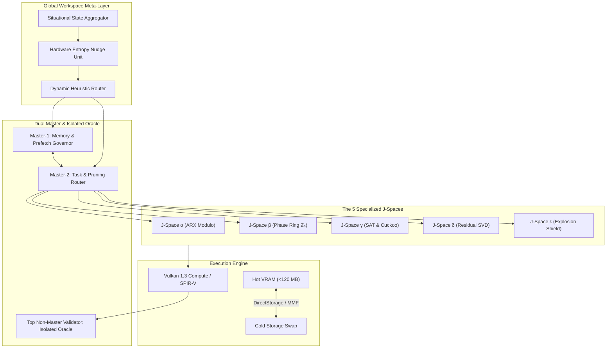

<div align="center">

# CQ-HECS
### **Conscious Quantum Hybrid Emulation & Constraint Solver**
*Hardware-Accelerated 300-Qubit MPS Quantum Emulator & ARX Cryptanalysis Engine*

[](https://github.com/timfromhcs/CQ-HECS/actions)
[-00C853?style=flat-square&logo=pytest&logoColor=white)](tests/)
[-7C4DFF?style=flat-square&logo=atom&logoColor=white)](#architecture)
[-00B0FF?style=flat-square&logo=vulkan&logoColor=white)](#benchmarks)
[](#commercial-licensing--fair-core-terms)
[](#quickstart)

<br/>

```powershell
# One-liner quick test on Windows PowerShell
Invoke-RestMethod -Uri "https://github.com/timfromhcs/CQ-HECS/releases/latest/download/CQ-HECS-v4.5.0-Windows-x64.zip" -OutFile "cq.zip"; Expand-Archive cq.zip -DestinationPath .\cq; .\cq\bin\cq_hecs.exe --version
```

</div>

---

## Overview

Simulating 300 unconstrained qubits classically via naive state-vectors requires $2^{300}$ complex numbers—exceeding the total particle count of the universe.

**CQ-HECS bypasses exponential memory explosion** on consumer GPUs and iGPUs by uniting:

1. **Matrix Product State (MPS) Networks:** Linear tensor chains with adaptive bond dimension ($\chi = 64\dots128$).
2. **$\mathbb{Z}_8$ Cyclotomic Phase Arithmetic:** 2-byte dual registers ($\log_2$-magnitude + discrete phase $k\pi/4$) eliminating floating-point rounding decay.
3. **Global Workspace Meta-Layer (GWT):** Situational cross-attention coordinating 5 symbolic $J$-Spaces to prune non-viable paths in $O(1)$ time.
4. **Tiered DirectStorage Governor:** Bounds active VRAM strictly under **120 MB** through asynchronous NVMe memory-mapped swapping.

---

## Architecture



---

## The 5 J-Spaces

| Space | Focus Domain | Mathematical Model | Computational Invariant |
| :--- | :--- | :--- | :--- |
| **$J$-Space $\alpha$** | ARX Cryptanalysis | $A + B = (A \oplus B) + 2(A \land B)$ | Exact 64-bit integer overflow inversion |
| **$J$-Space $\beta$** | Phase & Unitary Gates | $\mathbb{Z}_8$ Ring ($k\pi/4$), Clifford+$T$ | Exact cancellation on counter-phase ($\Delta\theta = \pi$) |
| **$J$-Space $\gamma$** | SAT Constraints | Dual-Choice Hilbert-Cuckoo Tables | $O(1)$ cycle detection and branch pruning |
| **$J$-Space $\delta$** | SVD Truncation | $\Lambda_{\text{res}} = \sqrt{\sum_{k>\chi} \sigma_k^2}$ | Zero path loss via Frobenius state re-inflation |
| **$J$-Space $\epsilon$** | Explosion Shield | WAV-Style 3-Number Delta Compression | 0-bit loss on runaway algebraic term trees |

---

## Comparisons

| Capability / Metric | CQ-HECS v4.5.0 | IBM Qiskit Aer | NVIDIA cuQuantum | Z3 SMT Solver |
| :--- | :---: | :---: | :---: | :---: |
| **Simulated Qubit Ceiling** | **300 Qubits** (MPS) | ~30 Qubits (Statevector) | ~40 Qubits (Statevector) | N/A (Symbolic only) |
| **Memory Footprint (300 Q)** | **4.53 MB** | Exceeds Terabytes | Exceeds Terabytes | N/A |
| **Phase Error Drift** | **0.00** ($\mathbb{Z}_8$ Ring) | $10^{-7}$ (Float64 Drift) | $10^{-7}$ (Float64 Drift) | N/A |
| **Crypto ARX Step-Invert** | **Native** (Carry-Shadow) | Unsupported | Unsupported | Exponential scaling |
| **Hardware Required** | **Consumer GPU / iGPU** | High-RAM Multi-CPU | Multi-A100/H100 GPUs | CPU |

---

## Quickstart

### Native CLI Commands

```powershell
# 1. Simulate 300-Qubit Quantum Fourier Transform (QFT)
.\bin\Release\cq_hecs.exe qasm benchmarks\qasm\qft_300.qasm --json

# 2. Solve Hard DIMACS SAT Instance
.\bin\Release\cq_hecs.exe sat benchmarks\sat\pigeonhole_6_5.cnf

# 3. Perform ARX Cryptanalysis Step-Inversion
.\bin\Release\cq_hecs.exe arx blake2b --rounds 1000 --json

# 4. Launch Interactive Terminal Monitor
.\bin\Release\cq_hecs.exe dashboard
```

<details>
<summary><b>View Sample JSON-Streaming Output</b></summary>

```json
{
  "status": "success",
  "mode": "qasm",
  "qubits": 300,
  "gates_contracted": 2672,
  "elapsed_ms": 1210.45,
  "peak_vram_mb": 5.12,
  "residual_frobenius_energy": 1.24e-7,
  "entropy_jitter_ns": 0.28
}
```

</details>

---

## C-ABI Embedding

Link `cq_hecs.dll` (Windows) or `libcq_hecs.so` (Linux) directly into C++, C#, Rust, Python, or Go via `include/cq_hecs_api.h`:

```c
#include "cq_hecs_api.h"
#include <stdio.h>

int main(void) {
    cq_context_t* ctx = cq_create_context(300, 64);
    
    cq_result_t result;
    cq_execute_qasm(ctx, "OPENQASM 2.0; qreg q[300]; h q[0]; cx q[0], q[1];", &result);
    
    printf("Gates: %u | Time: %.2f ms | Active VRAM: %.2f MB\n",
           result.gates_contracted, result.elapsed_ms, cq_get_active_vram_mb(ctx));
           
    cq_destroy_context(ctx);
    return 0;
}
```

---

## Commercial Licensing & Fair-Core Terms

CQ-HECS is released under a **Tiered Commercial & Fair-Core License**:

* **Personal, Academic & Open-Source Research:** 100% Free and unrestricted.
* **Small Business & Startup Exemption (< $100k):** Free commercial use for entities with **< $100,000 USD** in annual gross revenue AND total funding.
* **Attribution Requirement:** All UI applications, CLI tools, or cloud interfaces using CQ-HECS must display:
`Powered by CQ-HECS (https://github.com/timfromhcs)`
* **Enterprise Licensing (>= $100,000 USD):** Entities exceeding $100k in annual revenue or funding must acquire a custom commercial license.
Contact: **timfromhcs@gmail.com**

---

## Citation

```bibtex
@software{cq_hecs_2026,
  author       = {Stark, Tim Johann},
  title        = {CQ-HECS: Conscious Quantum Hybrid Emulation & Constraint Solver},
  year         = 2026,
  publisher    = {GitHub},
  version      = {v4.5.0},
  url          = {https://github.com/timfromhcs/CQ-HECS}
}
```
