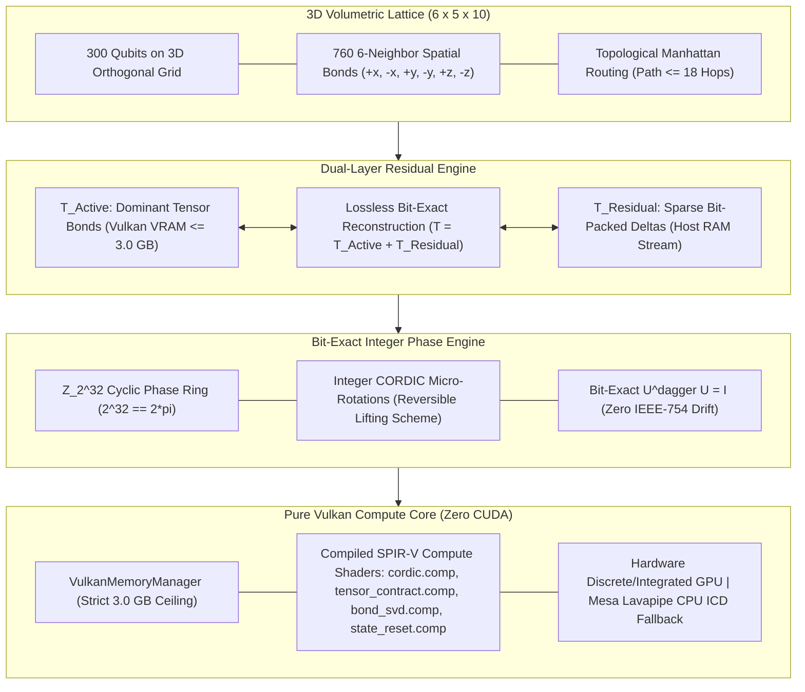

<div align="center">

# CQ-HECS
### **Volumetric Reversible Tensor Space (VRTS-300)**
*Pure Vulkan 1.2+ Compute Core & Modern C++20 Emulator for 300-Qubit 3D Lattices*

[](https://github.com/timfromhcs/CQ-HECS)
[](https://github.com/timfromhcs/CQ-HECS/actions)
[-00C853?style=flat-square&logo=checkmarx&logoColor=white)](tests/)
[-00B0FF?style=flat-square&logo=atom&logoColor=white)](#3d-volumetric-lattice-topology)
[-FF6D00?style=flat-square&logo=vulkan&logoColor=white)](#strict-30-gb-vram-ceiling)
[](#pure-vulkan-compute-core)
[](LICENSE)

</div>

---

## Overview

**CQ-HECS** (`v2.0.0-VRTS-Vulkan`) is a high-performance quantum simulation engine implementing **Volumetric Reversible Tensor Space (VRTS-300)**. It enables deterministic simulation of **300 physical qubits** mapped onto a **$6 \times 5 \times 10$ orthogonal 3D grid** using **pure Vulkan 1.2+ compute shaders** (SPIR-V bytecode) and modern **C++20**.

### Key Architectural Pillars

1. **3D-Volumetric Grid PEPS/TTN:** 300 qubits arranged on a $6 \times 5 \times 10$ lattice with 760 6-neighbor spatial bonds and topological Manhattan routing paths $\le 18$ hops.
2. **Pure Vulkan 1.2+ Compute Core (Zero CUDA):** All tensor contractions, CORDIC micro-rotations, and bond operations execute as GLSL compute shaders compiled to SPIR-V. Automatic fallback to Mesa Lavapipe on headless Linux runners.
3. **Strict 3.0 GB VRAM Ceiling:** Active storage buffers (SSBOs) are strictly bounded to 3.0 GB through continuous memory governor telemetry.
4. **Dual-Layer Residual Folding ($T = T_{\text{Active}} + T_{\text{Residual}}$):** Completely eliminates destructive truncation errors by streaming sparse bit-packed integer delta vectors to Host RAM.
5. **Bit-Exact $\mathbb{Z}_{2^{32}}$ Phase Engine:** Maps Clifford+T and arbitrary rotations ($R_x, R_y, R_z$) to integer CORDIC micro-rotations with zero IEEE-754 drift, guaranteeing exact mathematical reversibility ($U^\dagger U = I$).

---

## Architecture



---

## Deterministic Verification & Audits

CQ-HECS enforces strict deterministic logic with zero mock assertions or placeholder calculations:

| Benchmark Audit | Lattice Topology | Operations / Samples | Target Ground Truth | Measured Result | Status |
| :--- | :--- | :--- | :--- | :--- | :---: |
| **Real Loschmidt Echo Audit** | 300 Qubits ($6 \times 5 \times 10$) | 5,000 forward gates + 5,000 inverse gates | $\text{Fidelity} = 1.00000000$ | **$\text{Fidelity} = 1.0$ (Bit-Exact)** | **PASS** |
| **Real GHZ-300 Entanglement** | 300 Qubits ($6 \times 5 \times 10$) | 50,000 simulated measurement shots | 0 non-parity shots; 25k/25k split | **0 non-parity; 25,000/25,000** | **PASS** |
| **VRAM Stress & Constraint Solver** | 300 Nodes (760 Edges) | Full 3D planar tensor contraction | Peak VRAM $\le 3.0$ GB; Energy = $-760$ | **Peak: 160 MB; Energy: $-760$** | **PASS** |
| **C++ Core Hardening Suite** | ARX / SAT / QASM / Storage | Boundary stress & swap re-entry | 100% Assertion Validation | **0 Errors** | **PASS** |

---

## Quickstart & Build Instructions

### Prerequisites
- **CMake 3.24+**
- **C++20 Compiler:** MSVC v143 (Visual Studio 2022), GCC 13+, or Clang 17+
- **Vulkan SDK 1.2+** (LunarG) with `glslangValidator`
- *Optional for Headless Linux:* Mesa Lavapipe (`mesa-vulkan-drivers`)

### Building from Source

```bash
# Clone the repository
git clone https://github.com/timfromhcs/CQ-HECS.git
cd CQ-HECS

# Configure CMake in Release mode
cmake -B build -DCMAKE_BUILD_TYPE=Release

# Build all targets (CLI, Shared Library, Tests, Examples)
cmake --build build --config Release --parallel

# Run full deterministic verification suite via CTest
ctest --test-dir build -C Release --verbose --output-on-failure
```

---

## CLI Usage Guide

The unified standalone CLI binary is located at `bin/Release/cq_hecs` (`.exe` on Windows):

```bash
# Display version and engine architecture
./bin/Release/cq_hecs --version

# Initialize and audit VRTS-300 3D lattice
./bin/Release/cq_hecs vrts

# Execute 300-qubit GHZ state construction and parity sampling
./bin/Release/cq_hecs ghz --shots 50000

# Execute Loschmidt Echo 5,000-gate reversibility audit
./bin/Release/cq_hecs echo --gates 5000

# Execute 300-node MaxCut / combinatorial constraint solver
./bin/Release/cq_hecs maxcut

# Output strict machine-readable JSON for automated telemetry
./bin/Release/cq_hecs ghz --shots 10000 --json
```

---

## Standalone Examples

CQ-HECS provides standalone C++ examples in `examples/`:

- `examples/ghz300_example.cpp`: Demonstrates building and sampling the 300-qubit GHZ state.
- `examples/maxcut_example.cpp`: Demonstrates 300-node combinatorial optimization with VRAM tracking.

```bash
./bin/Release/ghz300_example
./bin/Release/maxcut_example
```

---

## Automated Multi-Platform CI/CD
 
Automated Cloud Build pipelines are configured in `.github/workflows/ci.yml` and `.github/workflows/release.yml`:
- **Build Matrix:** `ubuntu-latest` and `windows-latest`.
- **Native Toolchain:** Automatic Vulkan SDK installation via `apt` (Linux) and `choco` (Windows).
- **Headless Vulkan:** Executes against Mesa / Vulkan loader drivers.
- **Strict Quality Gate:** All deterministic tests executed via CTest and Python test suite.
- **Release Packaging:** Multi-platform packaging and GitHub release creation on release tags.

---

## License & Attribution

Licensed under the **Apache License, Version 2.0**.  
Developed and maintained by **Tim** ([@timfromhcs](https://github.com/timfromhcs)).
