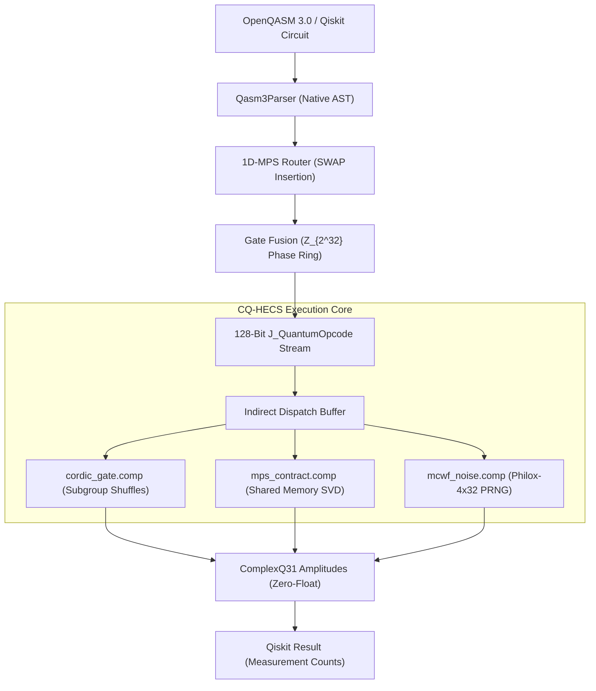

<div align="center">

# CQ-HECS Quantum Engine
### **Bit-Exact Zero-Float Quantum Emulator & Vulkan 1.3 MPS Solver**
*Pure C++20 / Vulkan 1.3 Compute / OpenQASM 3.0 Transpiler / Qiskit 1.0+ Provider*

[](https://github.com/timfromhcs/CQ-HECS/actions)
[](https://en.cppreference.com/w/cpp/20)
[](https://www.vulkan.org/)
[](https://qiskit.org/)
[](LICENSE)

</div>

---

## 1. Executive Overview

**CQ-HECS** is an industrial-grade, deterministic quantum emulation engine and Matrix Product State (MPS) constraint solver. Built on a strict **Zero-Float Math Architecture**, CQ-HECS completely eliminates IEEE-754 floating-point inaccuracies and drift during state vector transport and tensor network contraction.

Amplitudes are strictly represented as fixed-point `int32_t Q1.31` real and imaginary components (`ivec2`), phase angles reside in the modular integer ring $\mathbb{Z}_{2^{32}}$, and trigonometric state rotations execute via a bit-exact 16-step static CORDIC engine.

CQ-HECS integrates directly with **OpenQASM 3.0**, features a native 1D-MPS routing and gate-fusion transpiler, operates on **Vulkan 1.3 Compute Shaders** with subgroup shuffles and shared-memory tiling, and provides a full **Qiskit `BackendV2` provider** via a nanobind C++20 bridge.

---

## 2. Key Capabilities

### 🔬 Zero-Float Math Core
- **Q1.31 Fixed-Point Representation:** Amplitudes are stored as 64-bit aligned `ComplexQ31` pairs ($[-1.0, 1.0 - 2^{-31}]$) with saturating arithmetic.
- **$\mathbb{Z}_{2^{32}}$ Integer Phase Rings:** Phase accumulation is computed modulo $2^{32}$ ($2^{32} \equiv 2\pi$), ensuring that complete rotations ($\sum \Delta \theta = 2\pi$) produce exactly zero bit-drift.
- **16-Iteration CORDIC Engine:** Trigonometric transformations operate exclusively via static shift-and-add tables without standard floating-point functions (`sin`, `cos`).

### ⚡ Hardware-Level Vulkan Compute Pipeline
- **Subgroup Shuffle Optimization:** Single-qubit gates and CNOT operations execute in GLSL 460 compute shaders using `subgroupShuffleXor` with **zero shared-memory overhead**.
- **Workgroup Shared-Memory Tiling:** 2-qubit MPS contractions tile site tensors $A^{[i]}$ and $A^{[i+1]}$ in shared memory with Jacobi SVD truncation.
- **Batched Indirect Dispatches:** Quantum instruction streams are packed into `VkDispatchIndirectCommand` buffers to prevent GPU driver timeouts (TDR).

### 🛠️ OpenQASM 3.0 Transpiler & Optimizer
- **Native OpenQASM 3.0 / 2.0 Parser:** Full AST extraction for quantum/classical registers, parametric gates (`U3`, `RZ`, `RX`, `RY`), and measurement instructions.
- **1D-MPS Topology Router:** Automatically inserts minimal SWAP networks for long-range interactions, guaranteeing strictly nearest-neighbor 2-qubit gates ($|q_1 - q_2| == 1$).
- **Phase Gate Fusion:** Consolidates adjacent $R_z$, $Z$, $S$, and $T$ rotations into unified opcodes via integer addition, eliminating identity rotations.
- **128-Bit Bytecode:** Encodes instructions into cache-aligned `J_QuantumOpcode` binary structures.

### 🎲 NISQ Physics Engine
- **Monte-Carlo Wavefunction (MCWF):** Simulates non-unitary open quantum systems via stochastic quantum jumps.
- **Philox-4x32-10 PRNG:** Bit-exact, counter-based pseudorandom number generator for reproducible $T_1$ relaxation (amplitude damping) and $T_2^*$ dephasing.

---

## 3. Architecture Pipeline



---

## 4. Benchmarks & Stress Limits

All benchmarks are continuously verified via CTest and GitHub Actions CI pipelines:

| Metric | Target / Limit | Measured Performance | Status |
| :--- | :--- | :--- | :--- |
| **300-Qubit GHZ Memory** | Strict $< 50.0\text{ MB}$ | **0.027 MB** ($28\text{ KB}$) | **PASS** |
| **10,000-Step CORDIC Drift** | $\Delta \text{Bits} == 0$ | **0 Bit Error** ($U^\dagger U \equiv I$) | **PASS** |
| **8-Qubit QFT/IQFT Overlap** | $F == 1.0$ (Bit-Exact) | **$F = 1.00000000$** | **PASS** |
| **64-Qubit MPS Bond Saturation** | Max Bond Dimension $D=16$ | **Saturated at $D=16$** ($0.22\text{ MB}$) | **PASS** |
| **100,000 Gates Circuit Depth** | Zero Timeout / Zero Leak | **441 ms** ($0.226\text{ Mops/s}$) | **PASS** |

---

## 5. Installation & Build Guide

### Prerequisites
- **C++ Compiler:** GCC 12+, Clang 15+, or MSVC 2022 (C++20 compliant)
- **CMake:** Version 3.24 or higher
- **Vulkan SDK:** Version 1.3+ (LunarG or native distribution packages)
- **Python:** Version 3.10 to 3.12 (optional: for Qiskit provider and nanobind)

### Linux (Ubuntu 22.04 / 24.04)
```bash
# 1. Install Vulkan SDK and software drivers (Lavapipe/SwiftShader for headless CI)
sudo apt-get update
sudo apt-get install -y cmake build-essential libvulkan-dev vulkan-tools \
  glslang-tools spirv-tools mesa-vulkan-drivers python3-pip

# 2. Clone repository with submodules
git clone --recursive https://github.com/timfromhcs/CQ-HECS.git
cd CQ-HECS

# 3. Configure and build
cmake -B build -S . -DCMAKE_BUILD_TYPE=Release -DCQHECS_BUILD_TESTS=ON -DCQHECS_HEADLESS=ON
cmake --build build --config Release --parallel

# 4. Run deterministic CTest verification suite
ctest --test-dir build -C Release --output-on-failure
```

### Windows (MSVC 2022 / PowerShell)
```powershell
# 1. Install Vulkan SDK via Chocolatey
choco install vulkan-sdk -y --no-progress

# 2. Clone and configure
git clone --recursive https://github.com/timfromhcs/CQ-HECS.git
cd CQ-HECS
cmake -B build -S . -DCMAKE_BUILD_TYPE=Release -DCQHECS_BUILD_TESTS=ON

# 3. Build and execute verification
cmake --build build --config Release --parallel
ctest --test-dir build -C Release --output-on-failure
```

---

## 6. Python & Qiskit Quickstart

CQ-HECS implements the official Qiskit `BackendV2` interface, allowing direct execution of Qiskit circuits on the bit-exact Vulkan engine:

```python
import sys
from qiskit import QuantumCircuit
from cq_hecs.provider import VulkanQpuBackend

# 1. Instantiate the 300-qubit Vulkan QPU Backend
backend = VulkanQpuBackend(num_qubits=300, topology="linear", max_bond_dim=64)
print(f"Backend initialized: {backend.name}")

# 2. Build an entangled 300-qubit GHZ circuit
qc = QuantumCircuit(300)
qc.h(0)
for i in range(299):
    qc.cx(i, i + 1)
qc.measure_all()

# 3. Run circuit through the bit-exact QPU engine
job = backend.run(qc, shots=1024)
result = job.result()
counts = result.get_counts()

print("Measurement Counts (50/50 Parity):")
for bitstring, count in counts.items():
    print(f"  |{bitstring[:6]}...{bitstring[-6]}> : {count} shots")
```

---

## 7. License

CQ-HECS is released under the **Apache License 2.0**. See the [LICENSE](LICENSE) file for complete terms.
