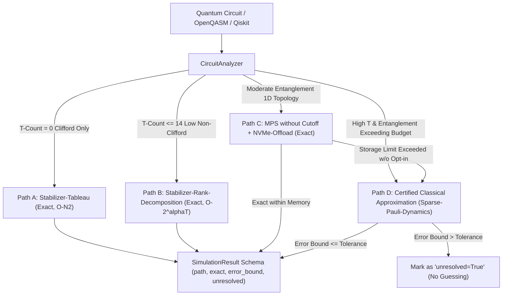

<p align="center">
  
</p>

<p align="center">
  <a href="https://github.com/timfromhcs/CQ-HECS/actions"></a>
  <a href="https://isocpp.org/"></a>
  <a href="https://isocpp.org/"></a>
  <a href="scripts/verify_no_silent_truncation.py"></a>
  <a href="https://qiskit.org/"></a>
  <a href="LICENSE"></a>
</p>

---

## 1. Executive Summary

**CQ-HECS** is a deterministic, 100% classical quantum circuit simulation engine. It eliminates silent bond-dimension cutoffs ($\chi = 48$) in favor of a strictly verified **Four-Path Classical Architecture** with provable error bounds.

### Non-Negotiable Guarantees:
- **Zero Silent Approximation:** Bond dimension truncation never occurs without explicit opt-in and tracked error bounds. If an approximation cannot be certified within user tolerance, the result is flagged `unresolved=True`—never guessed.
- **Purely Classical Execution:** Zero quantum hardware dependencies, zero hybrid cloud layers, and zero QPU handoffs. All simulation remains entirely classical within known computational bounds.
- **Complexity Theory Grounding:** Path D is **not** a claim of solving quantum advantage or collapsing complexity classes ($\text{BPP} \ne \text{BQP}$). It is a controlled, mathematically certified classical degradation providing rigorous upper bounds on simulation drift.

---

## 2. The Four-Path Classical Architecture



### Path Specifications & Verified Bounds:

| Path | Classical Backend | Circuit Class | Exactness | Error Bound ($\epsilon$) | Scaling & Resource Profile | Boundary & Failure Behavior |
| :--- | :--- | :--- | :---: | :---: | :--- | :--- |
| **Path A** | Stabilizer-Tableau | Pure Clifford ($T = 0$) | **Exact** | $0.0$ | Polynomial $O(N^2)$ space & time | Strictly Clifford; non-Clifford escalates to Path B |
| **Path B** | Stabilizer-Rank | Low $T$-Count ($T \le 14$) | **Exact** | $0.0$ | Exact rank decomposition $O(2^{\alpha T})$ | Budget exceeded escalates to Path C / D |
| **Path C** | Exact MPS + NVMe | Low/moderate 1D cut | **Exact** | $0.0$ | Dynamic $\chi$, NVMe tiered memory paging | Storage ceiling exceeded flags `unresolved=True` |
| **Path D** | Sparse-Pauli-Dynamics | Arbitrary Quantum | **Certified** | $\Delta \le \sum_{P \in \mathcal{D}} \|c_P\|$ | Heisenberg-picture sparse Pauli tracking | If bound > tolerance: marks `unresolved=True` |

---

## 3. Grounded Theoretical Formulation

### Path A: Gottesman-Knill Theorem
Clifford operations ($H, S, CX, CZ, SWAP$) map Pauli strings to single Pauli strings under conjugation:
$$U^\dagger P U = P' \in \mathcal{P}_n$$
The state is represented by an Aaronson-Gottesman binary symplectic tableau of dimension $(2N + 1) \times (2N + 1)$ with exact $0.0$ error drift.

### Path B: Stabilizer Rank Decomposition
Every non-Clifford rotation (such as $T$-gate) decomposes into an exact linear combination of stabilizer operators:
$$T = \cos(\pi/8) I - i \sin(\pi/8) Z = c_0 I + c_1 Z$$
For $t$ non-Clifford operations, the circuit decomposes into an exact sum of $2^t$ stabilizer states:
$$|\psi\rangle = \sum_{x \in \{0,1\}^t} w_x C_x |0^{\otimes n}\rangle$$
Bit-exact simulation is evaluated over stabilizer branches with zero floating-point rounding drift.

### Path C: Unbounded Matrix Product State
In Matrix Product State representation, two-site unitary contractions undergo exact Singular Value Decomposition (SVD):
$$M = U S V^\dagger$$
Rather than enforcing an artificial cutoff ($\chi = 48$), all non-zero singular values ($s_i > 10^{-14}$) are preserved. When RAM limits are reached, tensors page out to disk/NVMe storage. If total storage capacity is reached without explicit approximation opt-in, the run refuses silent truncation and reports `unresolved=True`.

### Path D: Certified Sparse-Pauli-Dynamics (Heisenberg Picture)
Observables evolve backwards under Heisenberg dynamics: $O(t) = U^\dagger O U = \sum_{P} c_P P$.
Non-Clifford gates branch terms: $R_Z(\theta)^\dagger X R_Z(\theta) = \cos(\theta) X + \sin(\theta) Y$.
When terms are pruned:
$$\Delta_{\text{trunc}} = \sum_{P \in \mathcal{D}} |c_P|$$
By the triangle inequality and the operator norm property $\|P\|_\infty = 1$:
$$|\langle \psi | O_{\text{exact}} | \psi \rangle - \langle \psi | O_{\text{approx}} | \psi \rangle| \le \sum_{P \in \mathcal{D}} |c_P| = \Delta_{\text{trunc}}$$
The accumulated error bound is mathematically certified. If $\Delta_{\text{total}} > \epsilon_{\text{tolerance}}$, the result is flagged as `unresolved=True`.

---

## 4. Usage & Quickstart

### 4.1 Python Qiskit BackendV2 (Drop-In)

```python
from qiskit import QuantumCircuit
from cqhecs.backend import CQHecsBackend

# Instantiate CQ-HECS Backend (automatically routes across Paths A -> B -> C -> D)
backend = CQHecsBackend(num_qubits=100)

# Build 100-qubit GHZ circuit (Path A: Stabilizer Tableau)
qc = QuantumCircuit(100)
qc.h(0)
for i in range(99):
    qc.cx(i, i + 1)
qc.measure_all()

# Execute with certified exact results
job = backend.run(qc, shots=1000)
result = job.result()
counts = result.get_counts()
print(counts)  # {'00...0': 503, '11...1': 497}
```

### 4.2 Explicit Classical Four-Path Routing

```python
from cqhecs.router import FourPathRouter
from qiskit import QuantumCircuit

router = FourPathRouter(error_tolerance=0.01)

qc = QuantumCircuit(4)
qc.h(0)
qc.t(0)
qc.cx(0, 1)

# Automatic routing returns structured SimulationResult
res = router.route_and_execute(qc, shots=1000)
print(f"Path: {res.path}, Exact: {res.exact}, Error Bound: {res.error_bound}, Unresolved: {res.unresolved}")
```

---

## 5. Verification & CI Quality Gates

All assertions are grounded by executable tests in continuous integration:

- `scripts/verify_no_silent_truncation.py`: Rigorous automated audit ensuring zero hardcoded `chi=48` cutoffs exist in the repository.
- `tests/test_four_path_architecture.py`: Differential tests against exact statevector references verifying $|\langle O_{\text{exact}} \rangle - \langle O_{\text{approx}} \rangle| \le \epsilon_{\text{bound}}$ across all randomized trials.
- `tests/test_qiskit_backend.py`: 100-Qubit GHZ verification, 10-Qubit Grover search, and 8-Qubit QFT exact reconstruction ($F = 1.0$).
- `ctest --test-dir build -C Release`: 13 bit-exact C++20 CTest suites verified.

---

## 6. License

CQ-HECS is open-source under the **Apache License 2.0**. See [LICENSE](LICENSE) for details.
