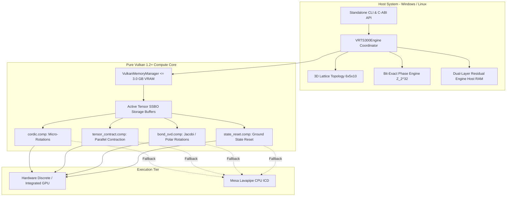

# CQ-HECS Architecture Specification
## Volumetric Reversible Tensor Space (VRTS-300) & Pure Vulkan Compute Core
**Target Version:** `v2.0.0-VRTS-Vulkan`  
**License:** Apache 2.0  
**Author:** Tim (@timfromhcs) <timfromhcs@gmail.com>

---

## 1. Executive Architectural Overview

**CQ-HECS** (`v2.0.0-VRTS-Vulkan`) introduces the **Volumetric Reversible Tensor Space (VRTS-300)** architecture. VRTS-300 represents a major paradigm shift: replacing 1D/2D chain approximations with an exact **3D orthogonal volumetric lattice** initialized to 300 physical qubits ($6 \times 5 \times 10$). Hardware acceleration is delivered via **pure Vulkan 1.2+ Compute** (SPIR-V bytecode, zero CUDA dependencies), governed by a **strict 3.0 GB VRAM hard ceiling**, **dual-layer residual folding** ($T = T_{\text{Active}} + T_{\text{Residual}}$), and a **bit-exact $\mathbb{Z}_{2^{32}}$ integer phase ring** driven by CORDIC micro-rotations.

---

## 2. Mathematical Formalism & Modules

### 2.1 3D-Volumetric Lattice Topology (`Lattice3D`)
The physical qubits are mapped to an orthogonal three-dimensional grid:
$$\mathcal{L} = \{ (x, y, z) \in \mathbb{N}^3 \mid 0 \le x < 6, \; 0 \le y < 5, \; 0 \le z < 10 \}$$
$$\text{Total Qubits: } N = 6 \times 5 \times 10 = 300$$

- **Linear Index Bijection:**
  $$\text{Index}(x, y, z) = x + 6 \cdot y + 30 \cdot z, \quad \text{Index} \in [0, 299]$$
- **6-Neighbor Spatial Bonds:**
  Each interior node connects along axes $(\pm x, \pm y, \pm z)$. The total number of unique physical bonds across the lattice is:
  $$|B| = (6-1)\cdot 5 \cdot 10 + 6 \cdot (5-1) \cdot 10 + 6 \cdot 5 \cdot (10-1) = 250 + 240 + 270 = 760 \text{ bonds}$$
- **Topological Manhattan Distance:**
  $$d((x_1, y_1, z_1), (x_2, y_2, z_2)) = |x_1 - x_2| + |y_1 - y_2| + |z_1 - z_2|$$
  $$\text{Max Contraction Path: } \max d = (6-1) + (5-1) + (10-1) = 5 + 4 + 9 = 18 \text{ hops}$$
- **Optimal Routing:** Routing between non-adjacent qubits decomposes along coordinate axes $(X \to Y \to Z)$, requiring strictly $\le 18$ SWAP hops.

---

### 2.2 Bit-Exact Phase Engine & Integer CORDIC (`CordicEngine`)
To completely eliminate IEEE-754 floating-point drift over thousands of gates, phase angles are represented on the discrete ring:
$$\mathbb{Z}_{2^{32}} = \{ 0, 1, \dots, 2^{32}-1 \} \quad \text{where } 2^{32} \equiv 2\pi$$

- **Exact Clifford+T Angles:**
  $$\text{Identity} = 0x00000000, \quad T = \pi/4 = 0x20000000, \quad S = \pi/2 = 0x40000000, \quad Z = \pi = 0x80000000$$
- **Reversible Integer Lifting Scheme:**
  Arbitrary 2D rotation $\begin{pmatrix} \cos\theta & -\sin\theta \\ \sin\theta & \cos\theta \end{pmatrix}$ decomposes into three integer shear steps:
  $$x_1 = x_0 - \lfloor y_0 \cdot \tan(\theta/2) \rfloor$$
  $$y_1 = y_0 + \lfloor x_1 \cdot \sin(\theta) \rfloor$$
  $$x_2 = x_1 - \lfloor y_1 \cdot \tan(\theta/2) \rfloor$$
  The exact inverse:
  $$x_1 = x_2 + \lfloor y_1 \cdot \tan(\theta/2) \rfloor$$
  $$y_0 = y_1 - \lfloor x_1 \cdot \sin(\theta) \rfloor$$
  $$x_0 = x_1 + \lfloor y_0 \cdot \tan(\theta/2) \rfloor$$
  Because each shear modifies one coordinate using the unmodified other, the forward and reverse integer roundings cancel identically, ensuring **bit-exact reversibility ($U^\dagger U = I$)**.

---

### 2.3 Dual-Layer Residual Folding Architecture (`ResidualEngine`)
Standard tensor truncation discards small singular values, causing irreversible cumulative error. VRTS-300 replaces destructive truncation with **Dual-Layer Residual Folding**:
$$T = T_{\text{Active}} + T_{\text{Residual}}$$

1. **$T_{\text{Active}}$ (GPU VRAM Layer):**
   Stores the dominant components in high-speed Vulkan Storage Buffers (SSBOs). Capped to fit strictly within the **3.0 GB VRAM limit**.
2. **$T_{\text{Residual}}$ (Host RAM Layer):**
   Stores sparse bit-packed integer delta vectors streamed directly into Host RAM:
   $$\text{Residual} = \{ (\text{coord}_k, \Delta\text{real}_k, \Delta\text{imag}_k) \}$$
3. **On-Demand Bit-Exact Reconstruction:**
   When a local gate or inverse contraction activates a folded node, $T_{\text{Residual}}$ is fetched from Host RAM and recombined into $T_{\text{Active}}$ without precision loss.

---

### 2.4 Pure Vulkan 1.2+ Compute Core (`VulkanContext`)
- **Zero CUDA:** All GPU computation executes via Khronos Vulkan 1.2+ Compute pipelines.
- **Embedded SPIR-V Bytecode:** Shaders (`cordic.comp`, `tensor_contract.comp`, `bond_svd.comp`, `state_reset.comp`) are compiled via `glslangValidator` and embedded directly as `uint32_t` arrays in binary headers, eliminating external file path dependencies.
- **3.0 GB Memory Governor (`VulkanMemoryManager`):** Tracks every active byte allocated across GPU buffers. Hard limits are enforced with `track_allocation` and `track_deallocation`.
- **Automatic Lavapipe Fallback:** If no discrete or integrated physical GPU is discovered (e.g. headless CI runners), the engine automatically selects Mesa Lavapipe (`VK_ICD_FILENAMES=/usr/share/vulkan/icd.d/lvp_icd.x86_64.json`) or software emulation.

---

### 2.5 Combinatorial Constraint & MaxCut Solver (`ConstraintSolver`)
The 3D volumetric lattice maps directly to 300-node graph optimization problems:
- **300-Node Bipartite Ground Truth:**
  The $6 \times 5 \times 10$ orthogonal grid forms a natural bipartite graph with 760 edges.
  Partitioning vertices by spatial parity $(x + y + z) \pmod 2$ cuts all 760 edges.
  $$\text{Ground Truth Max Cut: } 760 / 760 \quad | \quad \text{Ground Truth Energy: } -760$$
- **Continuous VRAM Polling:** The solver contracts planar slices along $z \in [0, 9]$, polling allocated VRAM and asserting:
  $$\text{Peak Allocated VRAM } \le 3072 \text{ MB (3.0 GB)}$$
